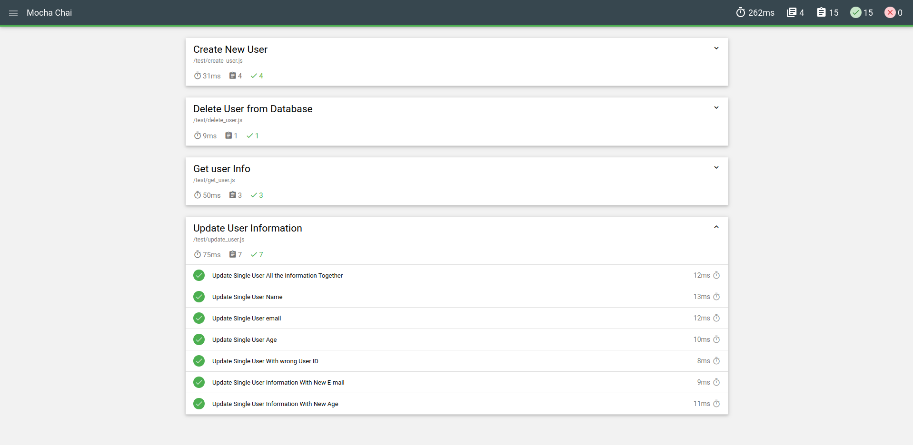

# Mocha-Chai-Unit-Testing

<b>Mocha</b> is a feature-rich JavaScript test framework running on Node.js and in the browser, making asynchronous testing simple and fun. Mocha tests run serially, allowing for flexible and accurate reporting, while mapping uncaught exceptions to the correct test cases.

<b>Chai</b> is a BDD / TDD assertion library for node and the browser that can be delightfully paired with any javascript testing framework. It provides functions and methods that help you compare the output of a certain test with its expected value.

Unit testing is the easiest way to improve the quality of your NodeJS applications since it helps in finding bugs and defects in your code. Moreover, the early discovery of Code bugs in the SDLC reduces the overall cost of development because less time is spent on bug fixing in the later stage of the project. This leads to overall customer satisfaction and helps in gaining more trustworthy clients.

The modules consist of tests related to handling of creating a user, deleting a user, getting information of all the users and updating users with complete and missing information too. 

The test report is generated as follows:

